# Godot Recycle Bin

some assets to improve or reuse for future Godot projects

## Scripts

### Mesh scatterer

#### example scattered trees and rocks

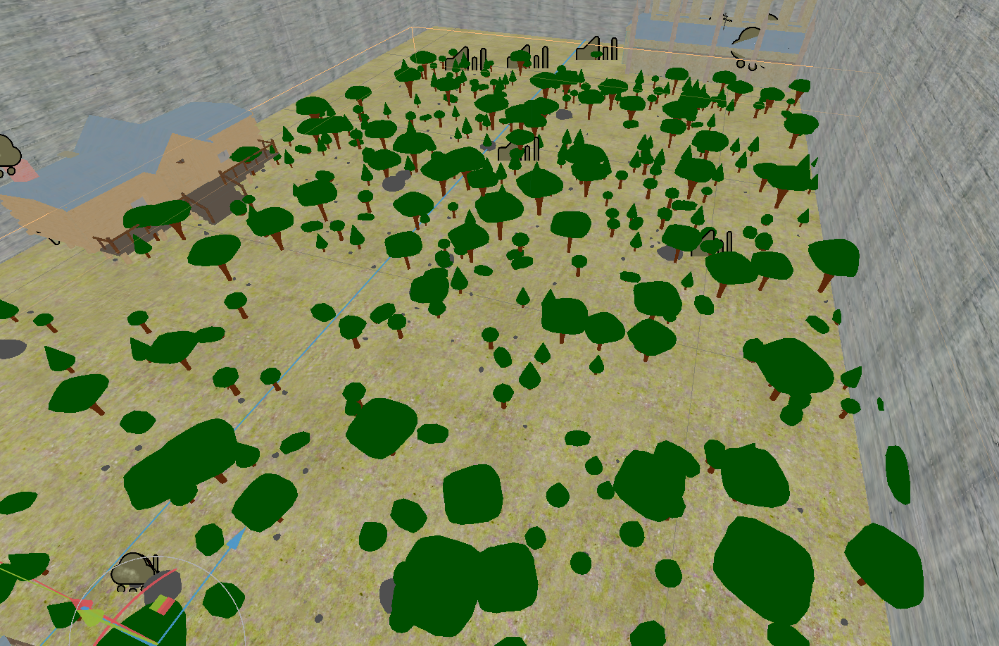

#### exported parameters

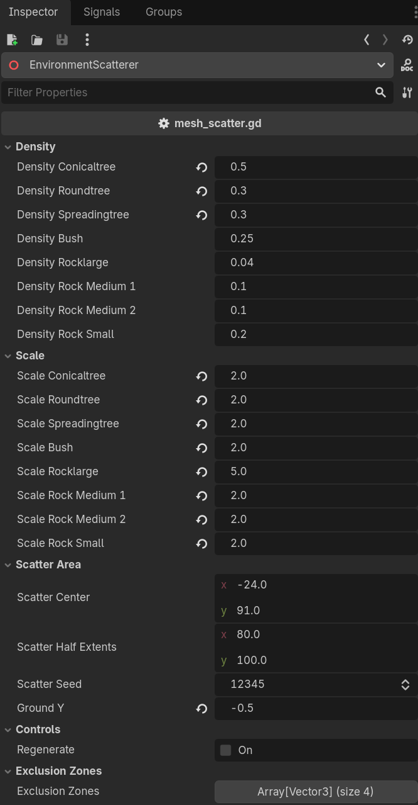

#### node structure

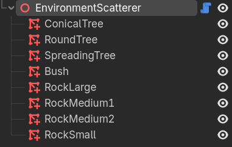

---

### Win-the-game button

currently set to end when two different 'buttons' are pressed, prompting the player to find the other when one is selected

folder also contains a corresponding switch script for the scene containing the collision shape where the player must stand to receive the 'press button' prompt

#### button-press prompt on collision shape

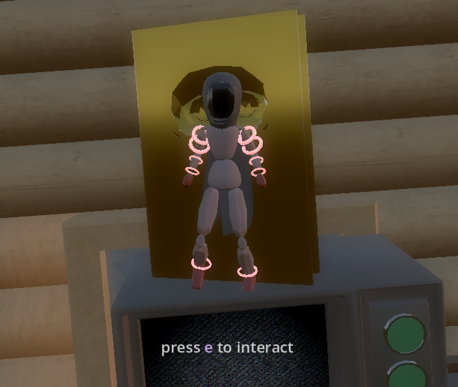

---

### Opening crawl

#### example opening crawl text

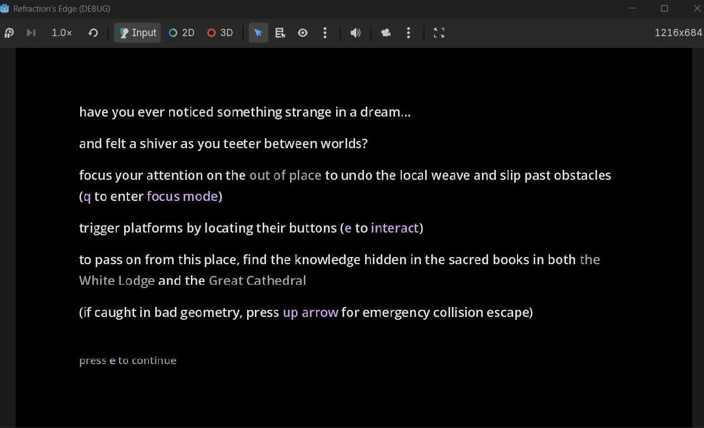

#### node structure

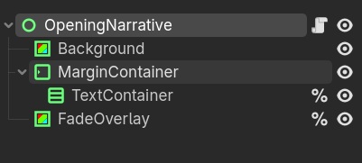

#### exported parameters

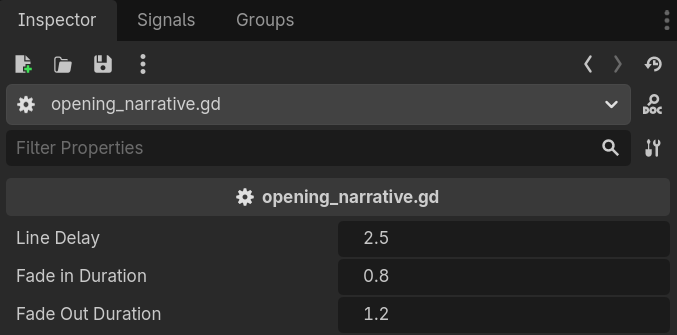

#### exported parameters

---

## Shaders

### Plane animation - "creepy CRT flicker + message"

white noise animation with sporadic apperance of nonsense symbols or the word "DOWN"

#### animation

#### exported parameters
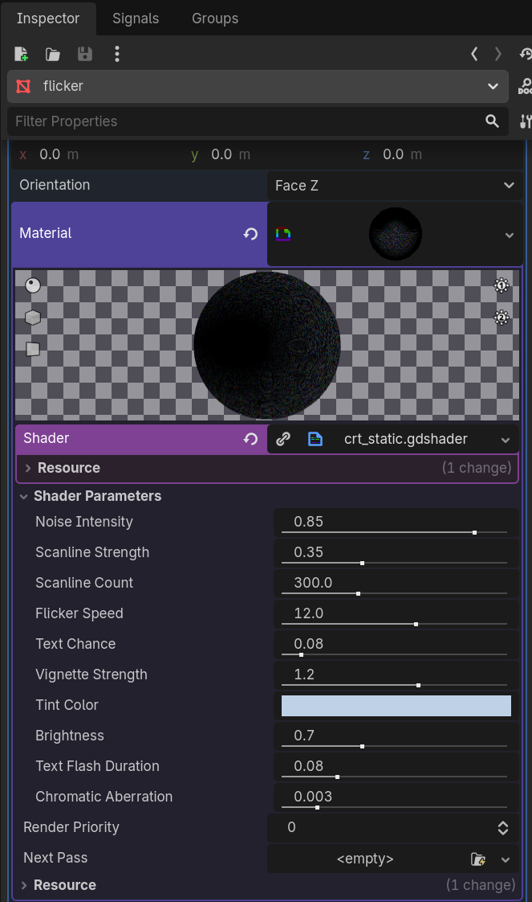
---

### Plane animation - "astral swirl"

pulsing, variable-armed, vibrantly colored spiral animation

#### screenshot

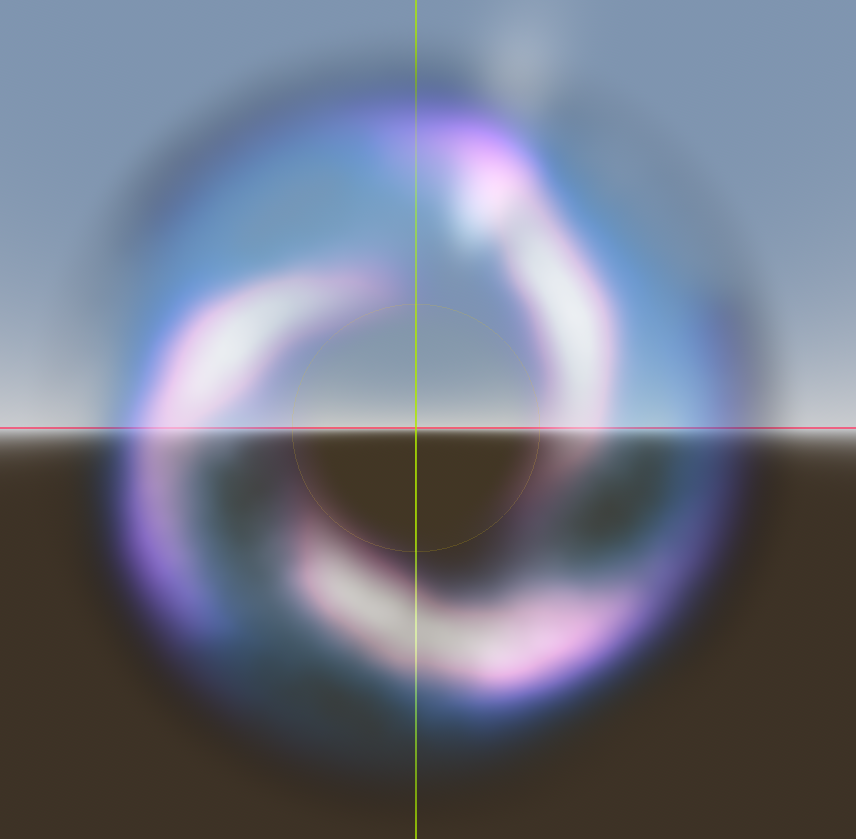

#### swirl animation

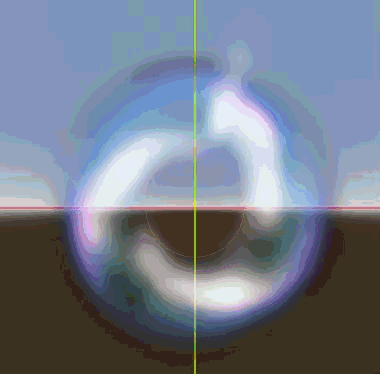

(colors do not lend themselves well to gif format)

#### exported parameters

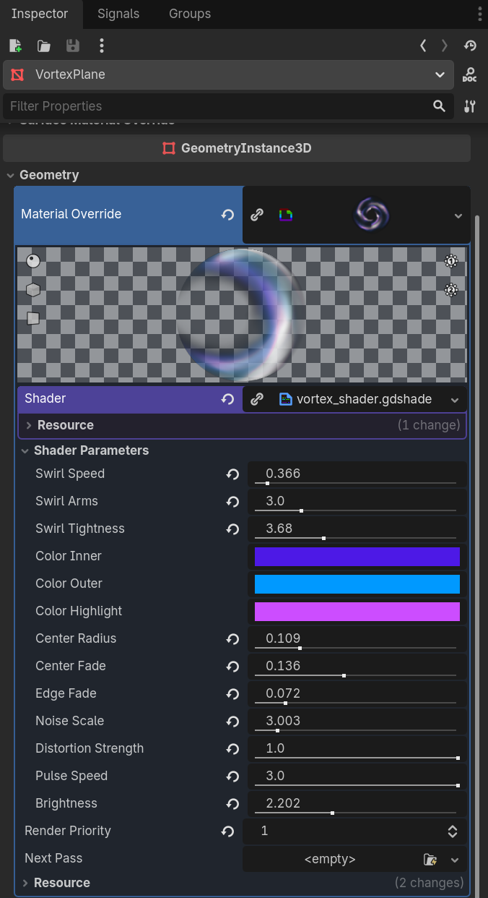

---